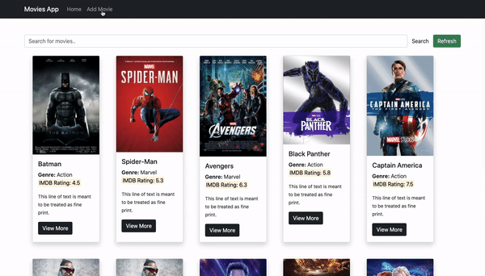
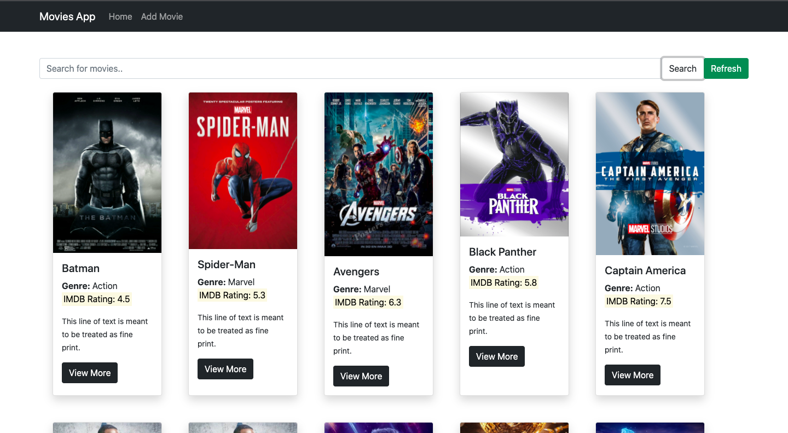
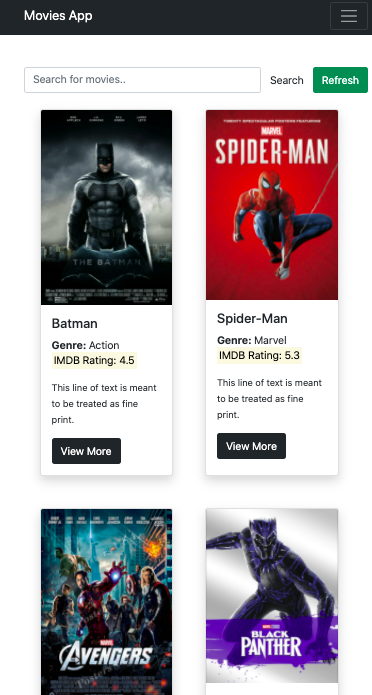
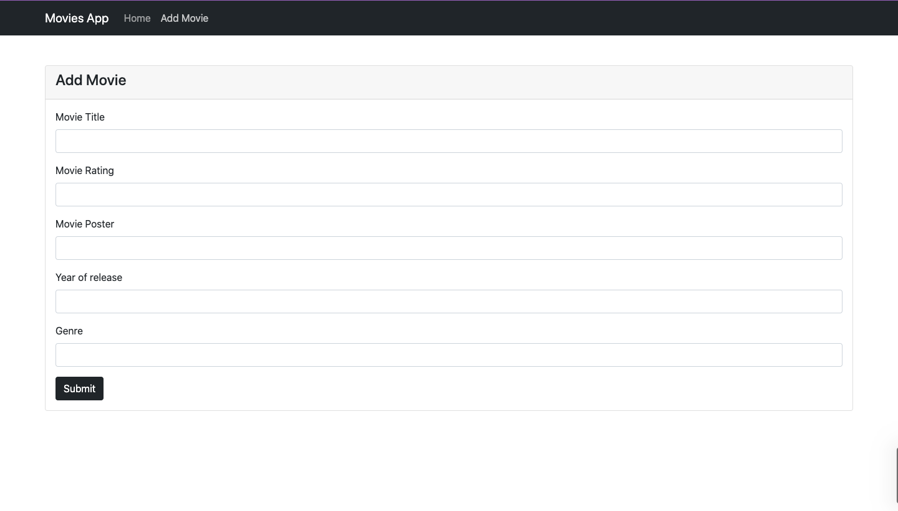

# React Movie APP
### Built With

-   [React](https://reactjs.org/)
-   [PostgreSQL](https://www.postgresql.org/)
-   [Express ](https://expressjs.com/)
-   [Node ](https://expressjs.com/)

### Getting Started

### Installation

1.  Clone the repo
    ``
    git clone https://github.com/grvcode/tap-movie-app
``
    
    
2.  Install NPM packages
    
    npm install
    
3.  Enter your API Port in in  `.env`
    ``
    const PG_URI = 'URL';
    ``

  # Preview:
  
  
  
  

